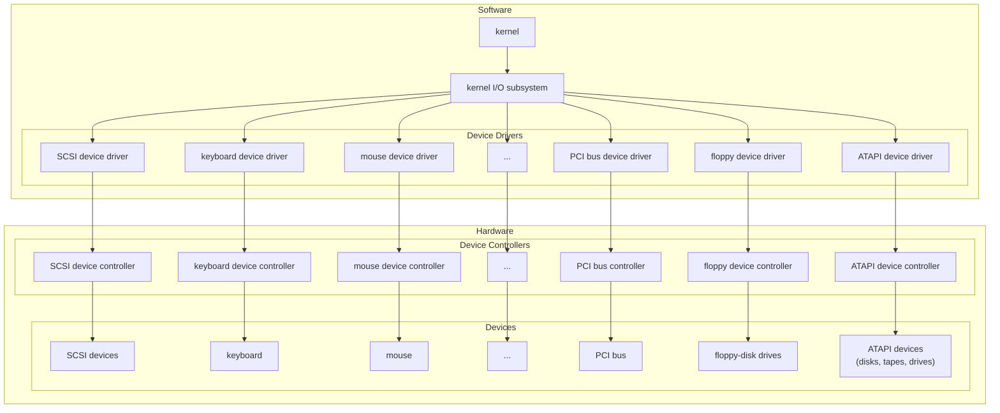
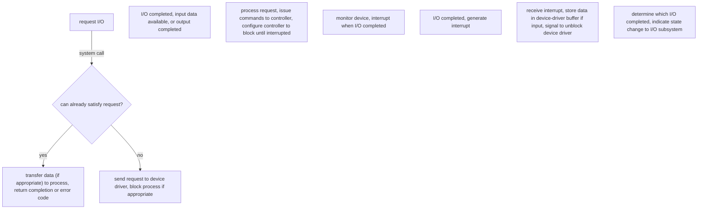

# Input/Output Devices and Drivers

## Communication with Devices

An I/O port represents the communication, and typically has 4 registers: data-in (input), data-out (output), control (how commands are given to device), status (current state of device).

There are three ways we can communicate with hardware devices:

1. Polling
   * When a command is issued, the controller marks the device as busy through a bit. When the operation is done, the bit is cleared.
   * The host has to check the device state until the busy bit is cleared.
   * Often the last choice but can be the only choice.
2. Interrupt
   * Some sort of interrupt request line (hardware) generates a signal indicating the presence of an interrupt. When the CPU sees this, the interrupt handler is executed.
   * Deals with the problem of not responding in time to data availability.
3. Direct Memory Access (DMA)
   * The DMA controller is given instructions about the operation to perform, the source, the destination and the amount of data to be transferred.
   * Efficient since data does not have to go to the CPU in between the source and destination.

## Application I/O Interface

Ideally when a general-purpose OS is written, it will accept new devices being added to it without needing to modify or recompile the code. We want to abstract away the hardware details to a certain extent, and provide a *uniform interface* to interact with.

In early OS development, the hardware the computer shipped with what all the hardware it ever supported. If new modules were released, the vendor would update the OS to support the new device.

OS developers realized that they could shift the work to hardware developers through *device drivers*; the driver plugs into the OS through a standard interface and mediates between the OS and device. This, however, fell apart because hardware developers didn't make great drivers.

The problem was made worse by a Windows design decision to run device drivers in kernel space. The driver could invoke the Blue Screen of Death if any error occurred. To remedy this, Microsoft (1) wrote and included a lot more device drivers in Windows and (2) introduced the static driver verifier, which all new drivers were required to pass to get approval from Microsoft.

When device drivers exist, they connect into the kernel's I/O subsystem.

Abstracting away hardware details makes things easier for OS developers. In Windows and Linux, there exists another layer to add indirection between the OS and platform-specific hardware (hardware abstraction layer; HAL). The HAL is supposed to make it easier to port the OS to new hardware. Unfortunately, every piece of hardware could be completely different:

* Data transform mode: character level (keyboard), blocks (disk)
* Access method: sequential access (one-by-one), random access
* Transfer schedule: synchronous, asynchronous
* Dedication: shareable (multiple concurrent threads), dedicated (single thread use).
* Device Speed: different devices have drastically different data rates
* Transfer direction: input only (temperature sensor), output only (speakers), both (hard disk)

## Block and Character I/O

Block device interface is used for block devices like hard disk drives. Any device will support `read` and `write` commands. If it is a random-access device, it will have a `seek` command to jump to a specific block.

Character-oriented devices like keyboards have `get` and `put` system calls.

## Network Devices

Network devices are fundamentally different from those directly attached to the system. The model we know is the socket model, where a socket is treated like a file.

## Spooling and Reservations

A spool is a buffer for a device, like a printer, that can only serve one job at a time.

## I/O Protection

Typically, we want all user access to I/O to be mediated through the OS, so it can check to see if the request is valid, and allow the request to proceed if it is. 

However, in certain circumstances, we might want to allow direct access. For example, with a game, we want to allow it to work directly on the graphic's cards memory. Mediating every access through the kernel would result in poor performance, so a section of graphics memory is locked by the kernel to be accessible by the game's process.

## Transforming I/O Requests to Hardware Operations

With regard to commands like `read`, we said it was the job of the device driver to translate this command into a hardware operation. 

The diagram below shows the life cycle of an I/O request.

Generally the life cycle follows ten steps from start to finish:

1. A process issues a system call.
2. The system call routine checks the parameters for correctness. If the data is in a cache or buffer, return it right away.
3. Otherwise, the process is blocked waiting for the device and the I/O request is scheduled. When the operation is to take place, the I/O subsystem tells the device driver.
4. The driver allocates a buffer to receive the data. The device is signalled to perform the I/O (usually by writing to device control registers or sending a bus signal)
5. The device controller operates the hardware to perform the operation
6. The driver may poll for status, await an interrupt when finished, or wait for the DMA controller to signal it is finished.
7. The interrupt handler receives the interrupt and stores the data, then signals the driver to indicate the operation is done.
8. The device driver identifies what operation has finished, determines the status and tells the I/O subsystem it is done.
9. The kernel transfers the data (or error code, etc.) to the address space of the requesting process and unblocks it.
10. When the scheduler chooses the process, it resumes execution.

## Buffering

The operating system can improve the performance of devices through buffering. A buffer is an area of memory that stores data being transferred, which is a good way to deal with speed mismatches between devices.

Buffering is a familiar concept through things like online video. If each piece of the video is delivered from the server to a computer exactly when needed, even a small hiccup in the network connection causes the video to stutter or pause until the next chunk arrives. To have a smoother experience, the video player most likely gets and stores the next few chunks in advance, so if there is delay in getting a chunk the playback isn't interrupted.

The idea of buffering is covered well in the video player example: we need a place to temporarily store data to decouple producing and consuming. We then need to make some decisions about how big the buffer should be. It isn't always better to make the buffer bigger; if the video player wants $n$ chunks before starting the video, then as $n$ increases, it delays the start of the video. Additionally, if the video starts but is skipped forward 30%, the player will have to download extra chunks that were not needed until that point.

Say $T$ is the time required to input a block and $C$ is the computation time between input requests. With no buffer, the execution time to complete a block is $T+C$, with a buffer its max is $\text{max}(C,T) + M$, where $M$ is the time to move the data from a system buffer to process memory.

Buffers are usually made with bounded capacity; they can hold $x$ bytes of data and once full, nothing else can fit so either (a) the data source is blocked until space is available or (b) older data can be overwritten with new data.

### Double and Circular Buffering

From the perspective of the computer, users type very slowly, and if we're writing to a file, it would be very inefficient to ask the disk to update itself on every character, since the disk is block-oriented. It is better to wait until we have some amount of data, and write this out all at once to the disk.

However, the write is not instantaneous and in the meantime the user can keep typing. To solve this, we use two buffers; while one is being emptied, the other receives incoming keystrokes. This is *double buffering*.

If we have $n$ buffers, it is referred to as circular buffering, with each individual buffer being part of the circular buffer.

## I/O Scheduling and Performance

There are potentially multiple I/O requests in progress at once, so the OS will need to track them in a device-status table that has an entry for each device, similar to how semaphores and their associated blocked threads are tracked by the OS.

When a thread wants to use a device, check its status; if its available then we mark the device as busy and send it to the device. The thread is marked as blocked until the operation is complete. If a thread shows up and wants to use a device that is already in use, its blocked and added to the queue. When the operation is complete, we unblock the waiting thread and let it continue. If no requests are waiting, the device is marked as idle. This is a first-come-first-served approach.

We sometimes want to schedule I/O requests differently because different devices may have non-uniform access times. The OS wants to avoid wasting effort with I/O requests. It will maintain a structure of requests and then can re-arrange them to accomplish them most efficiently.

This has some limits; requests should get scheduled before too much time has elapsed even if it will be inconvenient. It will also take into account priority, dealing with I/O requests from high priority processes even if they aren't nearby to other requests. There are tradeoffs necessary to balance utilization and fairness.

## Security

Device drivers offer an easy route for attackers to be able to get access they aren't supposed to have, since the drivers run at a high privilege level in the OS; there is a malware technique called BYOVD: bring your own vulnerable driver.

In principle, bad drivers shouldn't be installed because of driver signing like what Windows has. Trying to install a non-signed driver will usually result in the OS throwing a lot of warnings.

What happens if there is a vulnerability in an otherwise legitimate driver? This driver would've been fully validated and approved, where the problem is only discovered after the driver is released. If a fix is published, then anyone installing the new version is fine, but nothing prevents installing the old version. For this we need some kind of revocation; a previously-approved driver should be able to be un-approved so that the OS won't allow the vulnerable version to be used. 

In 2022, Microsoft had failed to properly apply updates to the driver block list which resulted in vulnerable drivers being installed. Microsoft did address this once reported, but late enough that there were cases of exploits taking place with these drivers. The installation rate for patches to any OS is never 100% as well, so vulnerable systems will continue to exist due to this oversight.