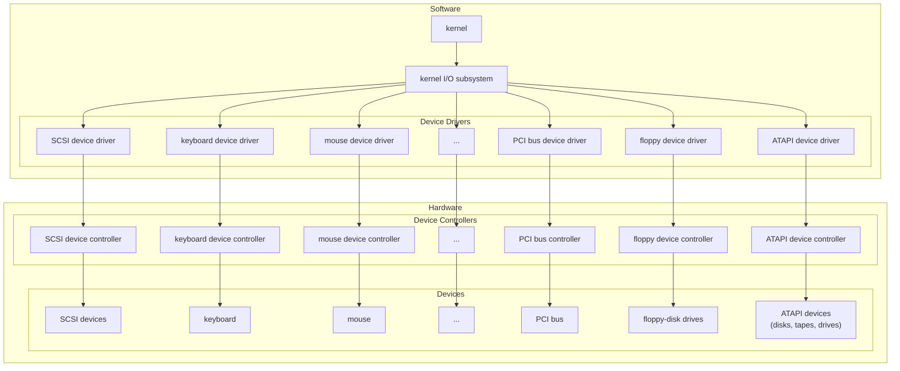

# Input/Output Devices and Drivers

## Communication with Devices

An I/O port represents the communication, and typically has 4 registers: data-in (input), data-out (output), control (how commands are given to device), status (currennt state of device).

There are three ways we can communicate with hardware devices:

1. Polling
   * When a command is issued, the controller marks the device as busy through a bit. When the operation is done, the bit is cleared.
   * The host has to check the device state until the busy bit is cleared.
   * Often the last choice but can be the only choice.
2. Interrupt
   * Some sort of interrupt request line (hardware) generates a signal indicating the prescence of an interrupt. When the CPU sees this, the interrupt handler is executed.
   * Deals with the problem of not responding in time to data availability.
3. Direct Memory Access (DMA)
   * The DMA controller is given instructions about the operation to perform, the source, the destination and the amount of data to be transferred.
   * Efficient since data does not have to go to the CPU in between the source and destination.

## Application I/O Interface

Ideally when a general-purpose OS is writen, it will accept new devices being added to it without needing to modify or recompile the code. We want to abstract away the hardware details to a certain extent, and provide a *uniform interface* to interact with.

In early OS development, the hardware the computer shipped with what all the hardware it ever supported. If new modules were released, the vendor would update the OS to support the new device.

OS developers realized that they could shift the work to hardware developers through *device drivers*; the driver plugs into the OS through a standard interface and mediates between the OS and device. This, however, fell apart because hardware developers didn't make great drivers.

The problem was made worse by a Windows design decision to run device drivers in kernel space. The driver could invoke the Blue Screen of Death if any error occurred. To remedy this, Microsoft (1) wrote and included a lot more device drivers in Windows and (2) introduced the static driver verifier, which all new drivers were required to pass to get approval from Microsoft.

When device drivers exist, they connect into the kernel's I/O subsystem.

Abstracting away hardware details makes things easier for OS developers. In Windows and Linux, there exists another layer to add indirection between the OS ad platform specific hardware (hardware abstraction layer; HAL). The HAL is supposed to make it easier to port the OS to new hardware. Unfortunately, every piece of hardware could be completely different:

* Data transform mode: character level (keyboard), blocks (disk)
* Access method: sequential access (one-by-one), random access
* Transfer schedule: synchronous, asynchronous
* Dedication: shareable (multiple concurrent threads), dedicated (single thread use).
* Device Speed: different devices have drastically different data rates
* Transfer direction: input only (temperature sensor), output only (speakers), both (hard disk)

## Block and Character I/O

Block device interface is used for block devices like hard disk drives. Any device will support `read` and `write` commands. If it is a random-access device, it will have a `seek` command to jump to a specific block.

Character-oriented devices like keyboards have `get` and `put` system calls.

## Network Devices

Network devices are fundamentally different from those directly attached to the system. The model we know is the socket model, where a socket is treated like a file.

## Spooling and Reservations

A spool is a buffer for a device, like a printer, that can only serve one job at a time.

## I/O Protection

Typically, we want all user access to I/O to be mediated through the OS, so it can check to see if the request is valid, and allow the request to proceed if it is. 

However, in certain circumstances, we might want to allow direct access. For example, with a game, we want to allow it to work directly on the graphic's cards memory. Mediating every access through the kernel would result in poor performance, so a section of graphics memory is locked by the kernel to be accessible by the game's process.